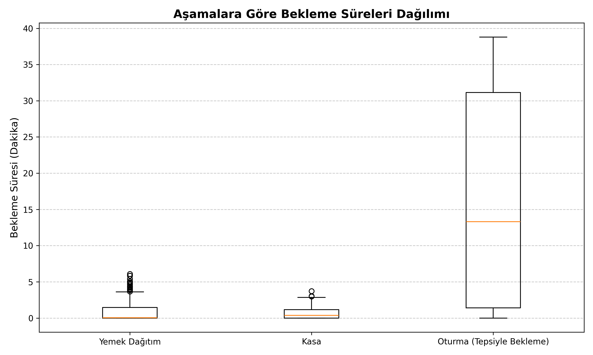
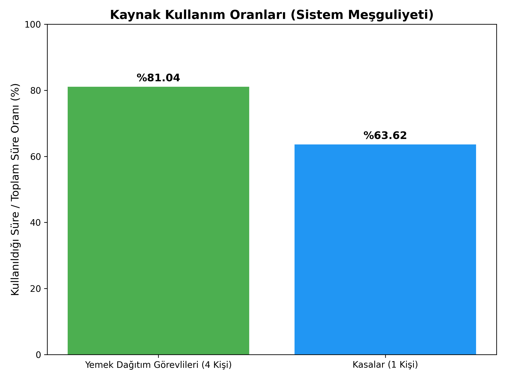
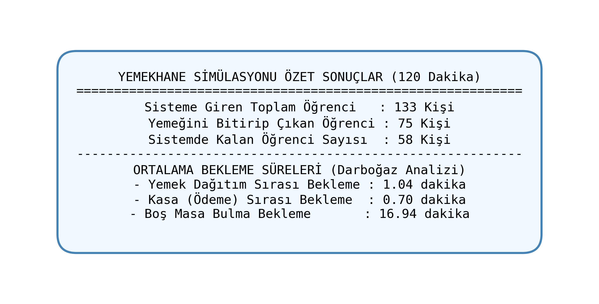

<div align="center">

# 🏢 Yemekhane Simülasyonu ve Süreç Optimizasyonu

**Ayrık Olay Simülasyonu (Discrete-Event Simulation) & Kuyruk Teorisi Analiz Projesi**

[](https://python.org)
[](https://simpy.readthedocs.io)
[](https://docs.python.org/3/library/tkinter.html)
[](LICENSE)

<br>

*Mersin Üniversitesi — Erdemli Uygulamalı Teknoloji ve İşletmecilik Yüksekokulu*
*Bilişim Sistemleri ve Teknolojileri / Yönetim Bilişim Sistemleri*

**Hüseyin Karakoç** — 22430070027

</div>

---

## 📋 İçindekiler

- [Proje Hakkında](#-proje-hakkında)
- [Özellikler](#-özellikler)
- [Sistem Mimarisi](#-sistem-mimarisi)
- [Kurulum](#-kurulum)
- [Kullanım](#-kullanım)
- [Dosya Yapısı](#-dosya-yapısı)
- [Simülasyon Parametreleri](#-simülasyon-parametreleri)
- [Analiz Sonuçları](#-analiz-sonuçları)
- [Ekran Görüntüleri](#-ekran-görüntüleri)
- [Teknolojiler](#-teknolojiler)

---

## 🎯 Proje Hakkında

Bu proje, bir üniversite yemekhanesindeki öğrenci akışını **SimPy** kütüphanesi kullanarak modelleyen bir **ayrık olay simülasyonudur**. Temel amaç, yemekhane içindeki üç hizmet noktasında (banko, kasa, oturma alanı) oluşan kuyrukları analiz etmek, **darboğaz noktalarını** tespit etmek ve verilere dayalı **kapasite optimizasyonu** yapmaktır.

Simülasyon, standart bir öğle arası olan **120 dakikalık** zaman diliminde çalışır ve şu soruları yanıtlar:

- 🔍 Hangi istasyonda en uzun kuyruk oluşuyor?
- ⚖️ Kaynaklar (görevliler, kasalar) ne kadar verimli kullanılıyor?
- 📉 Görevli/kasa sayısını değiştirmek sistemi nasıl etkiler?

---

## ✨ Özellikler

| Özellik | Açıklama |
|---------|----------|
| 🖥️ **Masaüstü GUI** | Tkinter ile modern, koyu temalı dashboard arayüzü |
| ⚙️ **Ayarlanabilir Parametreler** | GUI üzerinden banko/kasa/masa sayılarını ve süreleri değiştirme |
| 📊 **Çoklu Sayfa Görünümü** | Sidebar ile Genel Bakış, Banko, Kasa, Oturma, İstatistik sayfaları |
| 🔴 **Canlı İzleme** | Simülasyon gerçek zamanlı çalışır, kuyruklar emoji ile görselleşir |
| 📈 **İstatistik Paneli** | Verimlilik, kuyruk zirve değerleri ve anlık karşılaştırmalar |
| 🎞️ **Terminal Animasyonu** | Alternatif ASCII tabanlı canlı terminal gösterimi |
| 📉 **Grafik Çıktıları** | Matplotlib ile bekleme süreleri ve kaynak kullanım grafikleri |
| 🧪 **Tekrarlanabilir Sonuçlar** | `random.seed(42)` ile deterministik çalışma |

---

## 🆕 Son Değişimler ve Güncellemeler (v2.0)

Projeye dinamizm katan yepyeni özellikler sisteme başarıyla entegre edilmiştir:

1. **⏰ Zaman Dilimi Yönetimi:** "Pik Yoğunluk", "Erken Saatler" gibi farklı zaman dilimleri eklenerek simülasyon daha gerçekçi hale getirildi. 
2. **📋 Canlı Olay Günlüğü:** Her öğrencinin sisteme girişi, kuyruklara girmesi ve işlemleri arayüz üzerinden canlı ve ikonlu loglarla izlenebilir.
3. **👨‍🏫 VIP / Personel Önceliği:** Gelenlerin %15'i akademik personeldir. Personeller, **SimPy PriorityQueue** (Öncelikli Kuyruk) mantığıyla banko ve kasada öğrenci sıralarının önüne geçerler.
4. **⚠️ Rastgele Mola Sistemi:** Banko ve kasa çalışanları yoruldukça rastgele kısa molalara çıkarak geçici hizmet kesintilerine (gerçek hayattaki gibi sürpriz darboğazlara) sebep olurlar.
5. **💰 Finansal Ciro Takibi:** Öğrencilerden (50₺) ve personelden (100₺) alınan yemek ücretleri anlık olarak hesaplanıp Genel Bakış ekranında Ciro olarak yansıtılır.
6. **🚪 Turnike ve ♻️ Bulaşık Noktaları:** Yemekhane sisteminin girişine "Turnikeler" ve çıkışına "Tepsi/Bulaşık İade Noktası" adında 2 yeni kaynak dahil edilerek kapasite ve kuyruk analizi genişletildi.
7. **🗺️ Masa Grid Haritası:** Oturma alanındaki doluluk oranı, Tkinter Canvas üzerinde yeşil (boş) ve kırmızı (dolu) masalar şeklinde anlık çizilmektedir.

---

## 🏗️ Sistem Mimarisi

Yemekhane sistemi **3 aşamalı ardışık kuyruk** modelinden oluşur:

```
  Öğrenci Gelişi          1. AŞAMA              2. AŞAMA             3. AŞAMA
  (Üstel Dağılım)    ┌─────────────┐      ┌──────────────┐     ┌──────────────┐
                      │  🍲 Yemek   │      │  💵 Kasa /   │     │  🪑 Oturma   │
  🚶 🚶 🚶 ────────► │  Dağıtım    │ ───► │  Ödeme       │ ──► │  Alanı       │ ──► ✅ Çıkış
                      │  Bankosu    │      │  Noktası     │     │  (Masa)      │
                      └─────────────┘      └──────────────┘     └──────────────┘
                      Kapasite: 4            Kapasite: 1          Kapasite: 15
                      Normal Dağılım         Üstel Dağılım        Üstel Dağılım
                      μ=3dk, σ=0.5dk         μ=0.5dk              μ=20dk
```

Her aşama bir `simpy.Resource` ile modellenmiştir. Kaynak dolu olduğunda öğrenciler **FIFO kuyruğunda** sıra bekler.

---

## 🔧 Kurulum

### Gereksinimler

- Python **3.10** veya üzeri
- pip paket yöneticisi

### Adımlar

```bash
# 1. Depoyu klonlayın
git clone https://github.com/Krkc46/simulasyon.git
cd simulasyon

# 2. Sanal ortam oluşturun (opsiyonel ama önerilir)
python -m venv .venv

# Windows
.venv\Scripts\activate

# macOS/Linux
source .venv/bin/activate

# 3. Bağımlılıkları kurun
pip install simpy matplotlib
```

> **Not:** Tkinter, Python ile birlikte gelir; ayrıca kurulum gerektirmez.

---

## 🚀 Kullanım

### 1. Masaüstü GUI (Ana Uygulama)

```bash
python yemekhane_gui.py
```

- Uygulama açıldığında **⚙️ Ayarlar** sayfası karşınıza gelir
- Parametre değerlerini isteğinize göre değiştirin
- **🚀 SİMÜLASYONU BAŞLAT** butonuna basın
- Sol menüden farklı sayfalara geçerek istasyonları ayrı ayrı izleyin

### 2. Terminal Simülasyonu (Loglu)

```bash
python yemekhane_simulasyonu.py
```

Her öğrencinin hangi aşamaya geçtiği, bekleme süreleri ve sonunda özet rapor terminale basılır.

### 3. Canlı Terminal Animasyonu

```bash
python yemekhane_canli.py
```

Terminal ekranı sürekli yenilenerek ASCII tabanlı canlı pano gösterir.

### 4. Grafik Üretimi

```bash
python grafikleri_olustur.py
```

Simülasyonu çalıştırıp aşağıdaki grafikleri otomatik oluşturur:
- `bekleme_sureleri_grafigi.png`
- `kaynak_kullanim_oranlari_grafigi.png`
- `simulasyon_ozet_sonuclar.png`

---

## 📁 Dosya Yapısı

```
simulasyon/
│
├── yemekhane_gui.py              # 🖥️  Ana GUI uygulaması (Tkinter dashboard)
├── yemekhane_simulasyonu.py      # 📝  Detaylı loglu simülasyon (terminal)
├── yemekhane_canli.py            # 🎞️  Canlı terminal animasyonu (realtime)
├── grafikleri_olustur.py         # 📊  Matplotlib grafik üretici
│
├── Yemekhane_Proje_Raporu.md     # 📄  Akademik proje raporu
├── README.md                     # 📖  Bu dosya
│
├── bekleme_sureleri_grafigi.png  # 📈  Kutu grafiği çıktısı
├── kaynak_kullanim_oranlari_grafigi.png  # 📈  Çubuk grafik çıktısı
├── simulasyon_ozet_sonuclar.png  # 📈  Özet sonuç görseli
└── Proje_Kapagi.png              # 🎨  Proje kapak görseli
```

---

## ⚙️ Simülasyon Parametreleri

Tüm parametreler GUI üzerinden veya kaynak kodda değiştirilebilir:

### Kaynak Kapasiteleri

| Parametre | Varsayılan | Açıklama |
|-----------|------------|----------|
| `NUM_SERVERS` | 4 | Yemek dağıtım görevlisi sayısı |
| `NUM_CASHIERS` | 1 | Aktif kasa sayısı |
| `SEATING_CAPACITY` | 15 | Toplam oturma (masa) kapasitesi |

### Süre Parametreleri

| Parametre | Varsayılan | Dağılım | Açıklama |
|-----------|------------|---------|----------|
| `SIM_TIME` | 120 dk | — | Toplam simülasyon süresi |
| `ARRIVAL_MEAN` | 1.0 dk | Üstel | Öğrenci geliş aralığı ortalaması |
| `SERVING_MEAN` | 3.0 dk | Normal | Yemek alma süresi ortalaması |
| `SERVING_STD` | 0.5 dk | Normal | Yemek alma süresi standart sapması |
| `CASHIER_MEAN` | 0.5 dk | Üstel | Kasa işlem süresi ortalaması |
| `EATING_MEAN` | 20.0 dk | Üstel | Yemek yeme süresi ortalaması |

---

## 📊 Analiz Sonuçları

### Optimizasyon Öncesi → Sonrası

| Metrik | Öncesi (3 Banko, 2 Kasa) | Sonrası (4 Banko, 1 Kasa) |
|--------|--------------------------|---------------------------|
| Banko Meşguliyet | ~%94 (Darboğaz) | ~%75 (Dengeli) |
| Kasa Meşguliyet | ~%25 (Atıl) | ~%50 (Verimli) |
| Banko Bekleme Süresi | Yüksek | Düşük |
| Maliyet Etkinliği | Personel israfı | Optimize |

### Temel Bulgular

1. **Darboğaz Tespiti:** 3 görevli ile banko meşguliyeti %94'e çıkıyor — kuyruk sürekli artıyor
2. **Atıl Kapasite:** 2 kasa gereksiz — öğrenciler bankoda sıra beklerken kasalar boş kalıyor
3. **Optimizasyon:** Bankoya 1 görevli ekleme + 1 kasa kapatma = dengeli, tasarruflu sistem
4. **Oturma Darboğazı:** 15 masa ile yoğun saatlerde ayakta tepsiyle bekleme gözlemleniyor

---

## 🖼️ Ekran Görüntüleri

### Bekleme Süreleri Dağılımı


### Kaynak Kullanım Oranları


### Simülasyon Özet Sonuçları


---

## 🛠️ Teknolojiler

| Teknoloji | Kullanım Amacı |
|-----------|----------------|
| **Python 3.10+** | Ana programlama dili |
| **SimPy 4.x** | Ayrık olay simülasyon motoru |
| **Tkinter** | Masaüstü GUI framework |
| **Matplotlib** | Grafik ve görselleştirme |
| **Threading** | GUI'nin donmaması için arka plan simülasyonu |

---

## 📄 Lisans

Bu proje eğitim amaçlı geliştirilmiştir.

---

<div align="center">

*Mersin Üniversitesi — 2026*

**Hüseyin Karakoç** | [GitHub](https://github.com/Krkc46)

</div>
